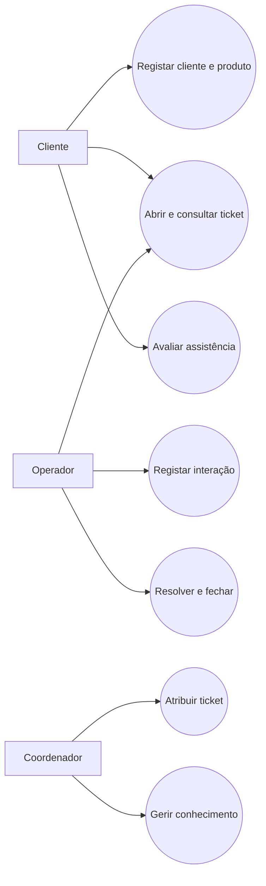
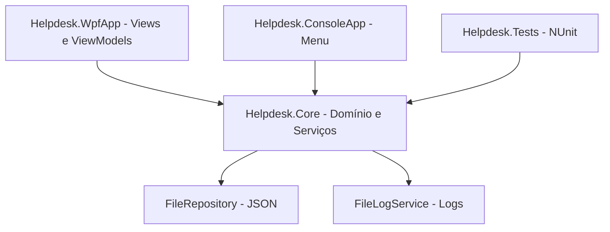
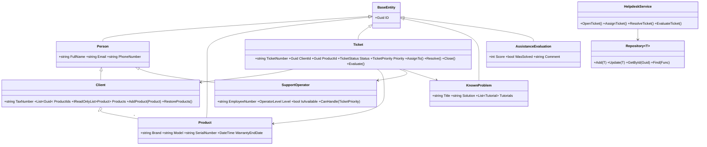
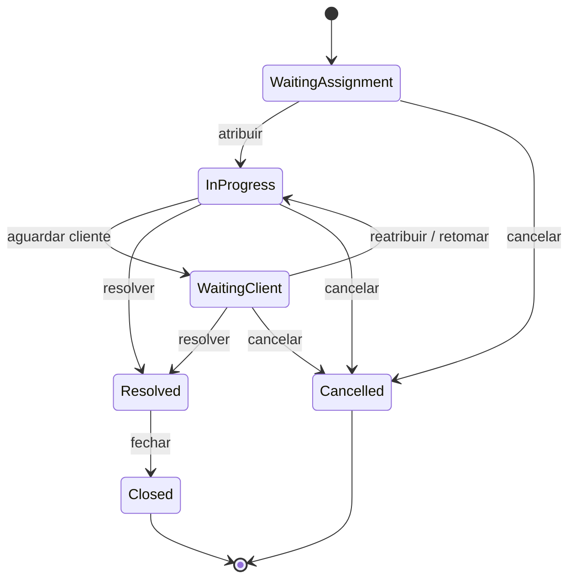
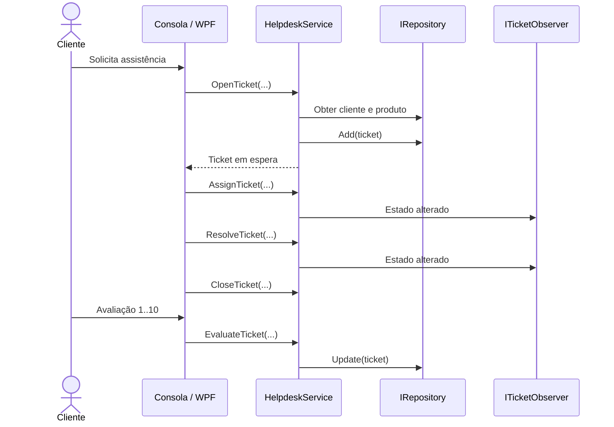

# Relatório do Trabalho Prático de Programação Orientada a Objetos

## Helpdesk - Sistema de Gestão de Assistências Técnicas

**Aluna:** Brenda Albuquerque  
**Número:** 27209  
**Curso:** Licenciatura em Engenharia de Sistemas Informáticos  
**Regime:** Pós-laboral  
**Unidade Curricular:** Programação Orientada a Objetos  
**Ano letivo:** 2025/2026  

# Resumo

Este relatório descreve a análise, o desenho e a implementação de um sistema de Helpdesk para gestão de assistências técnicas por telefone. A solução foi desenvolvida em C# e organizada numa biblioteca reutilizável, duas aplicações demonstradoras e um projeto de testes. O domínio contempla clientes, operadores, produtos, tickets, tipos e estados de assistência, problemas conhecidos, tutoriais, interações e avaliações de 1 a 10.

O projeto aplica os pilares da Programação Orientada a Objetos através de encapsulamento, herança, abstração e polimorfismo. Foram ainda utilizados os padrões Repository, Factory, Strategy, Singleton e Observer. A persistência é efetuada em ficheiros JSON, os acontecimentos relevantes são registados em logs e o fluxo dos tickets é controlado por uma máquina de estados. A biblioteca principal é consumida por uma aplicação de consola e por uma interface gráfica WPF organizada segundo MVVM.

A validação automática é assegurada por 25 testes NUnit. A medição realizada em configuração Debug obteve 84,83% de cobertura de linhas e 61,62% de cobertura de ramos na biblioteca `Helpdesk.Core`, ultrapassando o mínimo de 50% exigido no enunciado. Um workflow de GitHub Actions compila, testa e publica as aplicações demonstradoras como artefacto.

**Palavras-chave:** C#, Programação Orientada a Objetos, Helpdesk, WPF, MVVM, JSON, NUnit, Design Patterns.

# Abstract

This report describes the analysis, design and implementation of a Helpdesk system for managing technical support requests by telephone. The solution was developed in C# and organised into a reusable library, two demonstrator applications and a test project. The domain covers clients, support operators, products, tickets, assistance types and states, known problems, tutorials, interactions and customer ratings from 1 to 10.

The project applies the main Object-Oriented Programming principles: encapsulation, inheritance, abstraction and polymorphism. It also uses the Repository, Factory, Strategy, Singleton and Observer design patterns. Data is persisted in JSON files, relevant events are written to structured logs and ticket processing is controlled through validated state transitions. The main library is consumed by a console application and by a WPF graphical interface organised according to MVVM.

Automated validation is provided by 25 NUnit tests. The Debug coverage measurement reached 84.83% line coverage and 61.62% branch coverage in the `Helpdesk.Core` library, exceeding the 50% minimum defined in the assignment. A GitHub Actions workflow builds, tests and publishes the demonstrator applications as an artefact.

**Keywords:** C#, Object-Oriented Programming, Helpdesk, WPF, MVVM, JSON, NUnit, Design Patterns.

# Glossário

| Termo | Definição |
|---|---|
| Assistência | Pedido de apoio técnico efetuado por um cliente e representado no sistema por um ticket. |
| Entidade | Objeto do domínio com identidade própria, representada por um `Guid`. |
| Interface | Contrato que define operações sem impor uma implementação concreta. |
| Repositório | Componente responsável por armazenar, procurar, atualizar e remover entidades. |
| Ticket | Registo que acompanha um pedido desde a abertura até ao fecho e avaliação. |
| Interação | Mensagem trocada entre cliente e operador durante o acompanhamento do ticket. |
| Problema conhecido | Situação técnica já identificada, acompanhada de descrição, solução e tutoriais. |
| Persistência | Processo de guardar os dados para que permaneçam disponíveis após o encerramento da aplicação. |
| Serialização | Conversão de objetos para um formato gravável, neste caso JSON. |
| Observer | Objeto que é notificado quando ocorre uma alteração relevante noutro objeto. |
| Estratégia | Implementação substituível de um algoritmo, como o cálculo do prazo de resposta. |
| Cobertura | Percentagem de linhas ou ramos do código executados pelos testes automáticos. |

# Siglas e Acrónimos

| Sigla | Significado |
|---|---|
| UC | Unidade Curricular |
| POO | Programação Orientada a Objetos |
| OOP | Object-Oriented Programming |
| DLL | Dynamic Link Library |
| UI | User Interface |
| WPF | Windows Presentation Foundation |
| MVVM | Model-View-ViewModel |
| JSON | JavaScript Object Notation |
| LINQ | Language Integrated Query |
| CI/CD | Continuous Integration / Continuous Delivery |
| CLS | Common Language Specification |

# 1. Introdução

O trabalho prático da UC de Programação Orientada a Objetos propõe o desenvolvimento individual de uma solução em C# para um problema real de complexidade moderada. A solução deve identificar classes, escolher estruturas de dados adequadas e implementar serviços capazes de suportar os principais processos do domínio. Para além do funcionamento, são avaliados a estrutura do projeto, a reutilização de código, os princípios de POO, os padrões de desenho, as exceções, os logs, a persistência, os testes, a programação por camadas e a integração contínua.

O tema escolhido foi Helpdesk, uma das propostas do enunciado. Este domínio é apropriado para o trabalho porque contém entidades com responsabilidades diferentes, relações entre objetos, regras de negócio, estados, prioridades e processos com início e fim bem definidos. Permite demonstrar os conceitos da UC sem depender de uma interface gráfica complexa.

O sistema desenvolvido gere clientes e os seus produtos, operadores com diferentes níveis, tickets de assistência, interações, problemas conhecidos, tutoriais de resolução e avaliações finais. O foco principal encontra-se na biblioteca `Helpdesk.Core`, onde estão as entidades e regras de negócio. A consola e a interface WPF servem para demonstrar a reutilização dessa biblioteca.

# 2. Enunciado e Objetivos

## 2.1. Requisitos do enunciado

O enunciado define um conjunto de características obrigatórias e complementares. A tabela seguinte apresenta os requisitos relevantes e a resposta adotada no projeto.

| Requisito | Aplicação no projeto |
|---|---|
| Solução em C# | Quatro projetos em .NET 8, reunidos em `HelpdeskPOO.sln`. |
| Classes e serviços | Entidades do domínio e `HelpdeskService` com os processos principais. |
| Biblioteca reutilizável | `Helpdesk.Core` é uma DLL usada pela consola, WPF e testes. |
| Pilares de POO | Encapsulamento, herança, abstração e polimorfismo aplicados no Core. |
| Interfaces | `IRepository<T>`, `ILogService`, `IPriorityStrategy`, `ITicketObserver` e `IIdentifiable`. |
| Exceções customizadas | Hierarquia baseada em `HelpdeskException`. |
| Estruturas de dados | Dicionários, listas e filas, escolhidos segundo o tipo de acesso necessário. |
| Persistência em ficheiros | Cinco ficheiros JSON geridos por `FileRepository<T>`. |
| Logs | `FileLogService` regista data, nível e mensagem em ficheiro. |
| Programação por camadas | Core independente das aplicações; WPF organizada em MVVM. |
| LINQ e lambdas | Filtros, ordenações, pesquisas, validações e criação das filas. |
| Testes com cobertura mínima de 50% | 25 testes; cobertura de linhas de 84,83% em Debug. |
| Design Patterns | Repository, Factory, Strategy, Singleton e Observer. |
| CI/CD | GitHub Actions para restore, build, test, coverage, publish e artefacto. |
| Aplicação demonstradora | Menu de consola e interface gráfica WPF. |
| Conformidade CLS | `[assembly: CLSCompliant(true)]` e tipos públicos compatíveis. |

## 2.2. Objetivo geral

Desenvolver uma solução modular que permita registar e acompanhar pedidos de assistência técnica, aplicando de forma justificável os conceitos lecionados na UC.

## 2.3. Objetivos específicos

1. Registar clientes, operadores e produtos.
2. Abrir tickets associados a um cliente e a um produto registado.
3. Calcular o prazo de resposta de acordo com a prioridade.
4. Ordenar tickets em espera por prioridade e por ordem de chegada.
5. Atribuir tickets apenas a operadores disponíveis e habilitados.
6. Registar interações e associar problemas conhecidos e tutoriais.
7. Validar todas as transições do ciclo de vida do ticket.
8. Permitir avaliação entre 1 e 10 após o fecho.
9. Guardar os dados em JSON por identificadores, preservando instâncias canónicas após o carregamento.
10. Registar operações importantes em ficheiros de log.
11. Disponibilizar uma demonstração em consola e uma interface WPF.
12. Validar automaticamente as regras com testes unitários e cobertura superior a 50%.

## 2.4. Delimitação do âmbito

A palavra-chave `documentos` surge na descrição do tema Helpdesk. A gestão de anexos não foi implementada nesta fase, uma vez que não é necessária ao fluxo central e introduziria preocupações adicionais de armazenamento, formatos e segurança. O projeto cobre as restantes palavras-chave: assistência, tipo, estado, operador, cliente, produtos, problemas conhecidos, tutoriais e avaliação. Os anexos são registados como possibilidade de evolução futura.

# 3. Análise do Domínio

## 3.1. Atores

| Ator | Responsabilidade |
|---|---|
| Cliente | Solicita assistência, fornece informação, aguarda resolução e avalia o atendimento. |
| Operador | Acompanha tickets, regista interações, consulta conhecimento e resolve problemas. |
| Coordenador | Pode tratar qualquer prioridade e representa o perfil adequado para atribuições críticas. |
| Aplicação | Valida dados, guarda entidades, controla estados, escreve logs e apresenta resultados. |

## 3.2. Principais casos de uso

Os casos de uso centrais são registar cliente e produto, abrir ticket, consultar tickets, atribuir operador, registar interação, marcar espera pelo cliente, associar problema conhecido, resolver, fechar e avaliar a assistência.



Figura 1 - Diagrama simplificado de casos de uso.

## 3.3. Regras de negócio

| Código | Regra |
|---|---|
| RN01 | O email do cliente não pode ser repetido. |
| RN02 | O número de funcionário do operador não pode ser repetido. |
| RN03 | O número de série de um produto deve ser único. |
| RN04 | Um ticket só pode referenciar cliente e produto existentes. |
| RN05 | Operadores indisponíveis não podem receber tickets. |
| RN06 | Operadores Junior não podem tratar tickets Critical. |
| RN07 | Um ticket fechado ou cancelado não pode receber novas interações. |
| RN08 | Só tickets em progresso podem passar para espera pelo cliente. |
| RN09 | Um ticket precisa de operador antes de ser resolvido. |
| RN10 | Só tickets resolvidos podem ser fechados. |
| RN11 | Só tickets fechados podem ser avaliados. |
| RN12 | A avaliação deve estar entre 1 e 10. |

## 3.4. Prioridades e prazos

O prazo limite é calculado pela estratégia `DefaultPriorityStrategy`. A regra pode ser substituída por outra implementação de `IPriorityStrategy` sem alterar o serviço principal.

| Prioridade | Prazo máximo calculado |
|---|---:|
| Critical | 4 horas |
| High | 8 horas |
| Normal | 24 horas |
| Low | 72 horas |

# 4. Arquitetura e Organização do Projeto

## 4.1. Estrutura da solução

| Projeto / pasta | Responsabilidade |
|---|---|
| `Helpdesk.Core` | Biblioteca principal: modelos, interfaces, repositórios, serviços, exceções, padrões e logs. |
| `Helpdesk.ConsoleApp` | Aplicação demonstradora com menu textual e persistência local. |
| `Helpdesk.WpfApp` | Interface gráfica Windows organizada segundo MVVM. |
| `Helpdesk.Tests` | Testes unitários NUnit e recolha de cobertura com Coverlet. |
| `.github/workflows` | Workflow de integração e entrega contínua. |
| `.vscode` | Tarefas de compilação, testes e configurações de execução. |
| `docs` | Fonte do relatório técnico. |
| `output/pdf` | Versão final do relatório para entrega. |

Tabela 1 - Organização de alto nível da solução.

## 4.2. Organização da biblioteca Core

| Pasta | Conteúdo |
|---|---|
| `Models` | Entidades e validações do domínio. |
| `Enums` | Tipos de assistência, estados, prioridades e níveis de operador. |
| `Interfaces` | Contratos usados para desacoplamento. |
| `Collections` | Repositório genérico, persistência e fila de prioridade. |
| `Services` | Casos de uso, estratégia e observer de logs. |
| `Factories` | Criação centralizada de tickets. |
| `Logging` | Logger em ficheiro e logger nulo para testes. |
| `Exceptions` | Hierarquia de exceções específicas do Helpdesk. |

Tabela 2 - Responsabilidades internas de `Helpdesk.Core`.

## 4.3. Arquitetura por camadas

A interface WPF e a consola dependem da biblioteca Core. O Core não conhece elementos visuais nem escreve na consola. O projeto de testes também depende do Core, mas substitui componentes externos por repositórios em memória e `NullLogService`. Esta direção de dependências mantém a regra de negócio reutilizável e independente da apresentação.



Figura 2 - Arquitetura e direção das dependências.

## 4.4. Fluxo de uma operação

Quando o utilizador abre um ticket, a interface recolhe os dados e chama `HelpdeskService.OpenTicket`. O serviço procura o cliente e o produto através dos respetivos repositórios, delega a criação no `TicketFactory`, acrescenta a primeira interação, guarda o ticket, coloca-o na fila de prioridade e regista a operação no log. A interface recebe o objeto criado e atualiza a apresentação.

# 5. Modelo Orientado a Objetos

## 5.1. Entidades principais

| Entidade | Responsabilidade e dados principais |
|---|---|
| `BaseEntity` | Fornece um identificador `Guid` comum. |
| `Person` | Reúne nome, email e telefone de pessoas. |
| `Client` | Acrescenta número fiscal e produtos registados. |
| `SupportOperator` | Acrescenta número de funcionário, departamento, nível e disponibilidade. |
| `Product` | Marca, modelo, série, garantia e resumo para a interface. |
| `Ticket` | Agrega o pedido, referências, datas, prioridade, estado, interações e avaliação. |
| `TicketInteraction` | Guarda autor, mensagem, origem e data de uma interação. |
| `KnownProblem` | Guarda descrição, solução, tipo e tutoriais. |
| `Tutorial` | Contém título e conteúdo de apoio à resolução. |
| `AssistanceEvaluation` | Guarda pontuação, resultado, comentário e data. |

Tabela 3 - Entidades do domínio.

## 5.2. Diagrama de classes



Figura 3 - Diagrama simplificado das classes principais.

## 5.3. Encapsulamento das referências

O cliente serializa `ProductIds`, enquanto a propriedade de navegação `Products` tem `[JsonIgnore]`. O ticket segue a mesma abordagem: serializa apenas `ClientId`, `ProductId`, `AssignedOperatorId` e `KnownProblemId`, mantendo as propriedades de navegação fora do JSON. Depois do carregamento, o `HelpdeskService` usa esses IDs para religar clientes e tickets às instâncias canónicas dos repositórios.

`Client.RestoreProducts` confirma que a sequência de produtos corresponde a `ProductIds`; `Ticket.RestoreReferences` confirma individualmente os quatro identificadores antes de aceitar os objetos. Assim, o produto em `Client.Products`, o produto em `Ticket.Product` e o produto devolvido pelo repositório são a mesma instância, evitando cópias e dessincronização.

# 6. Pilares da Programação Orientada a Objetos

## 6.1. Encapsulamento

As entidades validam os próprios dados e controlam alterações importantes através de métodos. `Ticket.Resolve`, `Ticket.Close` e `Ticket.Evaluate` verificam o estado atual antes de alterar o objeto. `AssistanceEvaluation.Score` usa um campo privado e valida qualquer atribuição, impedindo valores fora do intervalo mesmo após a construção do objeto. O `Guard` concentra validações simples de texto, referências obrigatórias e pontuação.

## 6.2. Herança

`BaseEntity` é a classe base abstrata de todas as entidades identificáveis. `Person` herda de `BaseEntity` e reúne os atributos comuns de pessoas. `Client` e `SupportOperator` especializam `Person`, acrescentando dados e comportamentos próprios. A hierarquia de exceções também usa herança: as exceções específicas derivam de `HelpdeskException`, que por sua vez deriva de `Exception`.

## 6.3. Abstração

As interfaces representam capacidades sem revelar detalhes. `IRepository<T>` abstrai o armazenamento; `ILogService` abstrai a escrita de logs; `IPriorityStrategy` abstrai o cálculo de prazos; `ITicketObserver` abstrai reações a alterações de estado. O serviço depende destes contratos e não de implementações rígidas.

## 6.4. Polimorfismo

O mesmo `HelpdeskService` trabalha com `Repository<T>` em memória nos testes e com `FileRepository<T>` nas aplicações. O logger pode ser `FileLogService` durante a execução ou `NullLogService` nos testes. Uma estratégia de prioridade diferente pode substituir `DefaultPriorityStrategy` sem alterar o código consumidor.

# 7. Padrões de Desenho

| Padrão | Elementos | Justificação |
|---|---|---|
| Repository | `IRepository<T>`, `Repository<T>`, `FileRepository<T>` | Isola o acesso aos dados e permite trocar memória por ficheiro. |
| Factory | `TicketFactory` | Centraliza número, datas, prazo e criação consistente do ticket. |
| Strategy | `IPriorityStrategy`, `DefaultPriorityStrategy` | Torna substituível o algoritmo de cálculo do prazo. |
| Singleton | `FileLogService.GetInstance` | Mantém uma instância partilhada do logger e sincroniza a escrita. |
| Observer | `ITicketObserver`, `TicketLogObserver` | Reage a mudanças de estado sem colocar a lógica do log na entidade. |

Tabela 4 - Padrões de desenho aplicados.

## 7.1. Repository

`Repository<T>` usa um `Dictionary<Guid,T>` e implementa adição, atualização, remoção, pesquisa por ID, listagem e pesquisa por predicado. `FileRepository<T>` herda este comportamento e acrescenta `Save` e `Load` através de `System.Text.Json`.

## 7.2. Factory e Strategy

O `TicketFactory` recebe o cliente, produto, tipo, prioridade, assunto, descrição e estratégia. A factory cria o número legível, regista a data de abertura e pede à estratégia que calcule o limite. A criação deixa de estar dispersa pelas interfaces e mantém as mesmas regras em consola, WPF e testes.

## 7.3. Singleton e Observer

`FileLogService.GetInstance` aplica inicialização única e protege a criação e escrita com `lock`. O `TicketLogObserver` recebe `ILogService` por construtor e é inscrito no `HelpdeskService`. Nas operações que alteram o estado, o serviço notifica os observers com o estado anterior e o novo estado.

# 8. Estruturas de Dados e Algoritmos

| Estrutura | Local | Motivo da escolha |
|---|---|---|
| `Dictionary<Guid,T>` | `Repository<T>` | Pesquisa média constante por identificador e garantia de chave única. |
| `Dictionary<TicketPriority, Queue<Ticket>>` | `TicketPriorityQueue` | Uma fila FIFO por prioridade, mantendo justiça entre tickets equivalentes. |
| `List<Product>` | `Client` | Coleção pequena e ordenada de produtos do cliente. |
| `List<TicketInteraction>` | `Ticket` | Histórico sequencial de mensagens. |
| `List<Tutorial>` | `KnownProblem` | Conjunto extensível de passos de resolução. |
| `List<ITicketObserver>` | `HelpdeskService` | Permite vários subscritores de mudanças de estado. |

Tabela 5 - Estruturas de dados utilizadas.

## 8.1. Fila de prioridade

A `TicketPriorityQueue` cria uma fila para cada valor de `TicketPriority`. A leitura segue a ordem Critical, High, Normal e Low. Dentro de cada grupo mantém-se a ordem de chegada fornecida por `Queue<Ticket>`. Quando um ticket é atribuído ou cancelado, é removido da fila. A reconstrução da fila durante a remoção preserva a ordem dos restantes elementos.

## 8.2. LINQ e expressões lambda

LINQ é utilizado para ordenar tickets, filtrar por estado ou operador, validar duplicados, verificar a existência de IDs, converter valores do enum em filas e reunir os tickets na ordem desejada. As expressões lambda tornam os predicados explícitos junto da operação, por exemplo `t => t.Status == status`.

# 9. Ciclo de Vida do Ticket

## 9.1. Estados e transições



Figura 4 - Máquina de estados simplificada do ticket.

| Operação | Pré-condição | Resultado |
|---|---|---|
| Abrir | Cliente e produto existentes | `WaitingAssignment` e entrada na fila. |
| Atribuir | Operador disponível e habilitado | `InProgress` e saída da fila. |
| Aguardar cliente | Estado `InProgress` | `WaitingClient`. |
| Resolver | Operador atribuído e ticket ativo | `Resolved` e interação de resolução. |
| Fechar | Estado `Resolved` | `Closed` e data de fecho. |
| Cancelar | Ticket ainda não fechado | `Cancelled` e data de fecho. |
| Avaliar | Estado `Closed` | Avaliação associada, entre 1 e 10. |

Tabela 6 - Transições controladas do ticket.

## 9.2. Sequência do fluxo principal



Figura 5 - Diagrama de sequência do fluxo principal.

# 10. Persistência e Logs

## 10.1. Ficheiros JSON

| Ficheiro | Conteúdo |
|---|---|
| `clients.json` | Clientes e identificadores dos produtos associados. |
| `operators.json` | Operadores, níveis, departamentos e disponibilidade. |
| `products.json` | Catálogo canónico de produtos. |
| `known-problems.json` | Problemas conhecidos, soluções e tutoriais. |
| `tickets.json` | Tickets, IDs relacionados, interações, estado e avaliação. |

Tabela 7 - Ficheiros de persistência.

`FileRepository<T>` cria a pasta quando necessário, serializa a coleção com indentação e carrega os objetos para o dicionário interno. Depois de todos os repositórios serem carregados, o serviço reconstrói primeiro `Client.Products` a partir de `ProductIds` e, em seguida, as referências dos tickets. Esta ordem evita objetos duplicados e referências para entidades ainda inexistentes.

## 10.2. Logs

Os logs são gravados em `Data/logs/helpdesk.log` na consola e em `Data/logs/helpdesk-wpf.log` na aplicação gráfica. Cada entrada contém data, hora, nível e mensagem. São registadas operações como criação de clientes, abertura e atribuição de tickets, interações, resolução, fecho, avaliação e mudanças de estado.

O método de escrita trata exceções de I/O e de acesso não autorizado, evitando que uma falha secundária no log termine a operação principal.

# 11. Exceções e Validações

| Exceção | Situação representada |
|---|---|
| `HelpdeskException` | Base comum para erros específicos do domínio. |
| `DomainValidationException` | Dados inválidos ou regra de negócio não satisfeita. |
| `DuplicateEntityException` | Email, número de funcionário, série ou ID repetido. |
| `EntityNotFoundException` | Entidade pedida não existe no repositório. |
| `InvalidTicketTransitionException` | Mudança incompatível com o estado atual do ticket. |

Tabela 8 - Exceções customizadas.

As aplicações capturam `HelpdeskException` para mostrar uma mensagem compreensível e capturam `Exception` como proteção final. A regra mantém o Core responsável por detetar o erro e a apresentação responsável por decidir como comunicá-lo.

# 12. Aplicações Demonstradoras

## 12.1. Aplicação de consola

A consola demonstra os serviços através de um menu numerado. Permite ver o dashboard, listar clientes, produtos, operadores, tickets e problemas conhecidos, abrir e atribuir tickets, resolver, fechar e avaliar, registar clientes e registar produtos. Os dados são carregados no arranque e guardados após alterações e ao sair.

```text
=== Helpdesk Management System ===
1 - Ver dashboard
2 - Listar clientes e produtos
3 - Listar operadores
4 - Listar tickets
5 - Abrir novo ticket
6 - Atribuir ticket a operador
7 - Resolver ticket
8 - Fechar ticket
9 - Avaliar ticket
10 - Listar problemas conhecidos
11 - Registar cliente
12 - Registar produto
0 - Guardar e sair
```

## 12.2. Interface WPF e MVVM

A interface gráfica apresenta contadores, uma grelha de tickets, detalhes do ticket selecionado e comandos para as transições. Existem janelas próprias para criar cliente, produto e ticket. O utilizador pode ainda atribuir, marcar espera, resolver, fechar e avaliar.

| Elemento | Responsabilidade |
|---|---|
| `MainWindow.xaml` | Estrutura visual, bindings e controlos. |
| `MainViewModel` | Coleções observáveis, estado selecionado e comandos. |
| `BaseViewModel` | Implementação de `INotifyPropertyChanged`. |
| `RelayCommand` | Adapta métodos do ViewModel a `ICommand`. |
| `ApplicationDataService` | Carregamento, gravação e criação do serviço de domínio. |
| `NewClientWindow` | Formulário de cliente. |
| `NewProductWindow` | Formulário de produto associado a cliente. |
| `NewTicketWindow` | Formulário de abertura de ticket. |

Tabela 9 - Componentes da aplicação WPF.

A UI foi mantida como componente demonstradora. As regras permanecem no Core, de acordo com a recomendação do enunciado de só aprofundar a interface depois de cumprir os pontos obrigatórios.

# 13. Testes e Cobertura

## 13.1. Organização dos testes

Os testes utilizam NUnit 3.14, NUnit3TestAdapter, NUnit Analyzers, Microsoft.NET.Test.Sdk e Coverlet. Estão divididos por responsabilidade.

| Ficheiro | Casos principais |
|---|---|
| `HelpdeskServiceTests.cs` | Abertura, atribuição, operador Junior, ciclo completo, duplicados e avaliação. |
| `DomainRulesTests.cs` | Transições inválidas, produtos, fila, observer, logs, conhecimento e score. |
| `PersistenceTests.cs` | Gravação por IDs e identidade canónica entre cliente, produto e ticket. |
| `PriorityStrategyTests.cs` | Prazos de 4, 8, 24 e 72 horas. |

Tabela 10 - Organização dos testes unitários.

## 13.2. Resultados

Foram executados 25 testes, sem falhas nem testes ignorados. A cobertura em Debug foi medida com o comando:

```powershell
dotnet test HelpdeskPOO.sln --collect:"XPlat Code Coverage"
```

| Métrica | Resultado | Mínimo do enunciado |
|---|---:|---:|
| Testes aprovados | 25 de 25 | Não definido |
| Cobertura de linhas | 84,83% | 50% |
| Linhas executadas | 677 de 798 | - |
| Cobertura de ramos | 61,62% | Não definido |

Tabela 11 - Resultados dos testes e cobertura.

Os testes exercitam tanto os caminhos de sucesso como as recusas por regras de negócio. A persistência é validada com ficheiros temporários, que são eliminados no fim do teste. O `NullLogService` evita escrita desnecessária durante a maioria dos testes.

# 14. Integração e Entrega Contínua

O workflow `.github/workflows/dotnet.yml` é executado em `windows-latest`, escolha necessária porque a solução contém um projeto WPF direcionado a `net8.0-windows`. O processo realiza:

1. Checkout do repositório.
2. Instalação do .NET 8.
3. Restauro das dependências.
4. Compilação em Release.
5. Execução dos testes e recolha de cobertura.
6. Publicação da consola e da aplicação WPF.
7. Carregamento dos resultados publicados como artefacto.

Este processo fornece integração contínua e uma forma simples de entrega contínua dos executáveis gerados, sem substituir a submissão exigida no Moodle.

# 15. Matriz de Conformidade

| Critério de avaliação | Evidência no projeto | Estado |
|---|---|---|
| Estrutura e clareza do relatório | Relatório com diagramas, tabelas, glossário e síntese técnica. | Cumprido |
| Solução coerente e boas práticas | Separação de responsabilidades e nomes consistentes. | Cumprido |
| Biblioteca reutilizável | `Helpdesk.Core` usada por três projetos. | Cumprido |
| Interfaces, herança, abstração, polimorfismo e encapsulamento | Aplicados e descritos no capítulo 6. | Cumprido |
| Testes e cobertura mínima de 50% | 25 testes e 84,83% de linhas. | Cumprido |
| Exceções customizadas | Cinco classes numa hierarquia própria. | Cumprido |
| Estruturas de dados adequadas | Dictionary, Queue e List. | Cumprido |
| Logs estruturados | `FileLogService` com níveis e timestamp. | Cumprido |
| Persistência | Ficheiros JSON, referências por ID e objetos canónicos. | Cumprido |
| Programação por camadas | Core, consola, WPF/MVVM e testes. | Cumprido |
| CI/CD | GitHub Actions com build, test e publish. | Cumprido |
| LINQ e lambdas | Filtros, ordenações e validações. | Cumprido |
| Padrões de desenho | Cinco padrões implementados. | Cumprido |
| Interface opcional | WPF funcional, sem retirar foco ao domínio. | Cumprido |

Tabela 12 - Correspondência entre os critérios e a solução.

# 16. Limitações e Evolução Futura

As principais evoluções identificadas são a gestão de documentos anexos, autenticação e perfis, pesquisa avançada, reabertura controlada de tickets, notificações, base de dados relacional e edição de clientes ou produtos. Poderia também ser acrescentado um segundo observer para notificações e uma nova estratégia de prazos configurável por horário útil.

Estas melhorias não são necessárias para demonstrar os conteúdos da UC. Foram mantidas fora do âmbito para preservar uma solução compreensível, testável e defendível individualmente.

# 17. Conclusão

O sistema Helpdesk desenvolvido responde ao problema proposto no enunciado e cobre os processos essenciais de uma assistência técnica: registo do cliente e produto, abertura, priorização, atribuição, acompanhamento, resolução, fecho e avaliação. O modelo de domínio concentra as regras e impede transições inválidas, enquanto as aplicações demonstradoras reutilizam os mesmos serviços.

A solução evidencia os pilares de POO e o desacoplamento por interfaces. A utilização de Repository, Factory, Strategy, Singleton e Observer não foi apenas decorativa: cada padrão resolve uma necessidade concreta de armazenamento, criação, variação de algoritmo, partilha de logger ou reação a eventos. As estruturas de dados foram escolhidas segundo os acessos exigidos e a persistência por IDs evita cópias inconsistentes nos tickets.

Os 25 testes e a cobertura de 84,83% fornecem evidência automática do comportamento principal. O workflow de CI/CD repete compilação, testes e publicação num ambiente limpo. A consola e a aplicação WPF demonstram que a biblioteca pode ser consumida por apresentações diferentes.

Considera-se, assim, que os objetivos definidos foram atingidos e que a solução se encontra preparada para demonstração e defesa, mantendo uma dimensão adequada ao trabalho individual da UC.

# Referências

1. Ferreira, Luís G.; Casanova, Ernesto. *Trabalho Prático de Programação Orientada a Objetos - LESI/LESIPL 2025/2026*. EST-IPCA, 2025.
2. Microsoft. *Documentação do .NET 8 e C#*.
3. Microsoft. *Windows Presentation Foundation e padrão MVVM*.
4. NUnit Project. *NUnit Documentation*.
5. GitHub. *GitHub Actions Documentation*.

# Apêndice A - Comandos de Execução

```powershell
dotnet restore HelpdeskPOO.sln
dotnet build HelpdeskPOO.sln
dotnet test HelpdeskPOO.sln --collect:"XPlat Code Coverage"
dotnet run --project src/Helpdesk.ConsoleApp/Helpdesk.ConsoleApp.csproj
dotnet run --project src/Helpdesk.WpfApp/Helpdesk.WpfApp.csproj
```

No Visual Studio Code, também podem ser usadas as configurações `Executar Helpdesk.ConsoleApp` e `Executar Helpdesk.WpfApp` através de `F5`.
